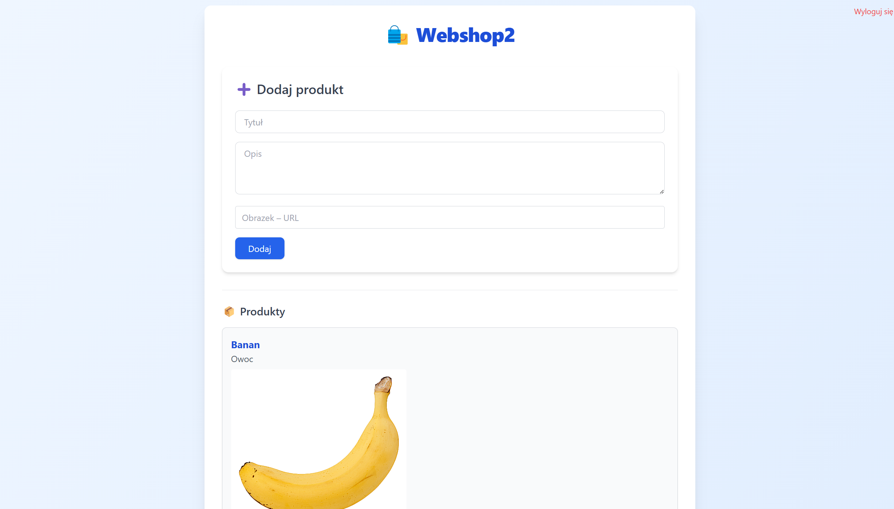
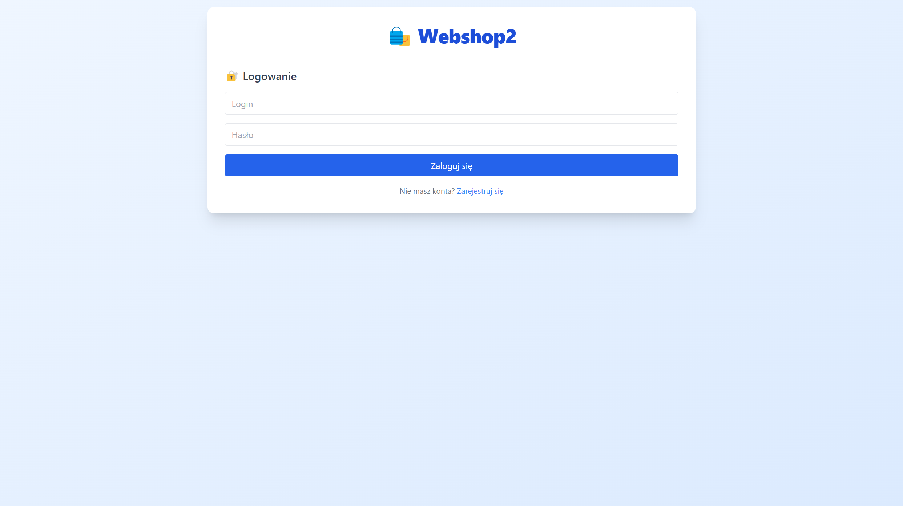

# Webshop2 – Full-Stack Product Management App

**Webshop2** is a full-stack web application that allows users to register, log in, and manage products. Authenticated users can add products, and admin users can delete them. Built with React and TailwindCSS on the frontend, and Node.js with Express and MongoDB on the backend.

---




## Features

- User registration and login
- Authentication using JSON Web Tokens (JWT)
- Add new products (requires login)
- Delete products (admin only)
- Responsive and modern UI (TailwindCSS)

---

## Technologies Used

### Frontend
- React.js
- Tailwind CSS
- Fetch API

### Backend
- Node.js
- Express.js
- MongoDB (Mongoose)
- JSON Web Tokens (JWT)
- dotenv for environment config

---
### Prerequisites
- Node.js and npm
- MongoDB (local or MongoDB Atlas account)

---
### Backend Setup
```
cd backend
node server.js
```
---
### Frontend Setup
```
cd frontend
npm install
npm start
```
